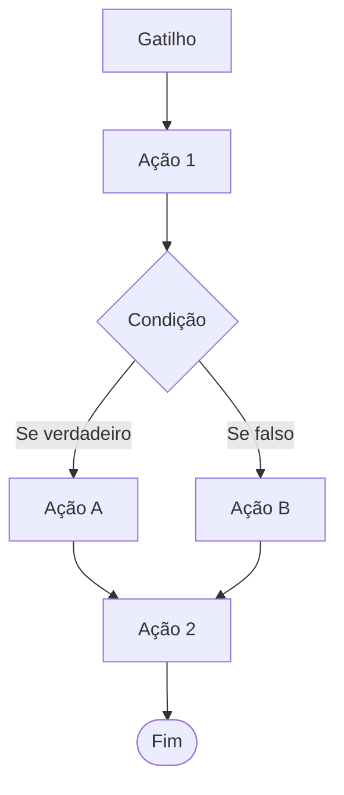

Entender a ordem de execução é o que separa uma automação que funciona de uma que "roda mas não faz nada". Esta página descreve exatamente o que acontece entre o evento e o último componente.

## O ciclo completo

<Steps>
<Step title="O evento acontece" icon="bolt">
  Alguém move um projeto, responde um formulário, vincula uma etiqueta — ou um agendamento chega na hora marcada.
</Step>

<Step title="O sistema procura automações compatíveis" icon="magnifying-glass">
  Só entram na disputa as automações **ativas** da sua conta cujo gatilho é do mesmo tipo do evento.
</Step>

<Step title="Cada automação confere as próprias opções" icon="list-check">
  Ter o gatilho certo não basta: as opções também precisam bater. Um gatilho de etapa configurado para "Proposta enviada" ignora um projeto que entrou em "Contrato assinado".
</Step>

<Step title="As que combinam executam, uma depois da outra" icon="play">
  Se três automações combinarem com o mesmo evento, as três rodam. Não há ordem garantida entre elas, então evite montar automações que dependam uma da outra pela ordem.
</Step>
</Steps>

<Note>
O gatilho **não é executado** como os outros componentes. Ele apenas decide se a automação roda. Quem executa são as ações e condições.
</Note>

## A ordem dos componentes

Os componentes rodam **de cima para baixo**, na ordem em que aparecem no editor. Use **Mover para cima** e **Mover para baixo** no menu de cada componente para reordenar.

A ordem importa sempre que um componente depende do efeito do anterior. Alguns exemplos reais:

- Colocar o projeto em uma etapa **antes** de aplicar uma etiqueta daquele funil — a etiqueta só é aplicada se o funil estiver vinculado.
- Adicionar um formulário avulso **antes** de atualizar um contador daquele formulário.
- Criar o cliente **antes** de enviar um e-mail que usa o nome dele.

## Condições e ramos

Uma condição avalia algo sobre o projeto e devolve verdadeiro ou falso. Isso define qual dos dois ramos executa:

<CardGroup cols={2}>
<Card title="Se verdadeiro" icon="check">
  Executa os componentes colocados neste ramo quando a checagem passa.
</Card>

<Card title="Se falso" icon="xmark">
  Executa os componentes deste ramo quando a checagem não passa.
</Card>
</CardGroup>

Depois de rodar o ramo escolhido, **o fluxo continua normalmente** para os componentes seguintes que estão no nível principal. Uma condição falsa não interrompe nada por padrão — ela apenas escolhe um caminho.

### Bloquear o fluxo

As condições têm a opção de **bloquear o fluxo**. Com ela ligada, quando a condição for **falsa**, o ramo "Se falso" ainda executa normalmente — e, terminado o ramo, a automação para ali. Os componentes seguintes do nível principal não rodam.

<Warning>
O bloqueio só acontece quando a condição é **falsa**. Uma condição verdadeira nunca interrompe o fluxo, independentemente dessa opção.
</Warning>

<Tip>
Isso permite uma saída elegante: coloque no ramo "Se falso" o que deve acontecer antes de desistir — um aviso, um registro no conteúdo — e o bloqueio garante que o restante do fluxo não execute.
</Tip>

Use o bloqueio para escrever regras do tipo "só continue se...":

<Steps>
<Step title="Quando">
  Um projeto entra na etapa "Faturamento".
</Step>

<Step title="Se (bloqueando o fluxo)">
  O projeto contém o status de funil "Aprovado". Se não contiver, a automação termina aqui.
</Step>

<Step title="Então">
  Gera a cobrança, avisa o financeiro, move para "Aguardando pagamento".
</Step>
</Steps>

### Mantenha as condições no nível principal

<Warning>
Uma condição colocada **dentro de um ramo** de outra condição é avaliada, mas os componentes dentro dos ramos dela **não são executados**. O fluxo suporta um nível de ramificação.

Para encadear duas checagens, coloque as duas no nível principal do fluxo, uma após a outra, usando **bloquear o fluxo** na primeira.
</Warning>

## O que acontece quando algo falha

Nem todo problema derruba a automação. O comportamento depende do tipo de falha:

<AccordionGroup>
<Accordion title="A ação não tinha o que fazer" icon="circle-minus">
  A maioria das ações tem pré-requisitos silenciosos: uma etiqueta só é aplicada se o funil dela estiver vinculado ao projeto, um contador só é atualizado se o formulário estiver disponível.

  Nesses casos a ação registra o motivo no log e **o fluxo continua** nos componentes seguintes.
</Accordion>

<Accordion title="Faltou permissão" icon="lock">
  O componente é marcado com erro no registro de execução, mas **o fluxo continua**. O log identifica qual permissão faltou.
</Accordion>

<Accordion title="Erro inesperado" icon="triangle-exclamation">
  Uma falha não prevista interrompe **toda a automação** naquele ponto. Os componentes seguintes não rodam e o registro de execução fica marcado com erro, incluindo a mensagem original.
</Accordion>

<Accordion title="A condição não conseguiu avaliar" icon="circle-question">
  Se a condição falha ao avaliar — por exemplo, um filtro salvo que ficou inválido — o erro é registrado, **nenhum dos dois ramos executa** e o fluxo segue para os componentes seguintes.
</Accordion>
</AccordionGroup>

## Automações que acionam automações

Uma ação pode provocar um evento que aciona outra automação. Mover um projeto de etapa, por exemplo, dispara o gatilho **Projeto movido de etapa** de qualquer outra automação configurada para aquela etapa.

Isso é esperado e útil, mas existe um teto: **uma cadeia pode encadear até cinco automações**. Ao chegar na sexta, a execução é interrompida e o registro aponta o motivo (`automation_run_limit_reached`).

<Tip>
Se uma automação "não terminou" sem motivo aparente, confira se ela está no fim de uma cadeia longa. O sintoma clássico é a automação funcionar quando disparada manualmente e falhar quando disparada por outra.
</Tip>

Cuidado especial com cadeias que voltam ao ponto de partida — uma automação que move o projeto para a etapa A, e outra na etapa A que move de volta. O limite impede o laço infinito, mas as duas gastam execuções do plano até estourar.

## O que a automação ignora e o que ela respeita

Automação não é ação de usuário: em parte do fluxo ela passa por cima das travas do funil, em parte não. A diferença é por ação.

| Ação | Restrições de entrada e bloqueios da etapa |
| --- | --- |
| Colocar projeto em etapa | **Ignora** — move mesmo que uma pessoa não conseguisse |
| Adicionar etiqueta | **Respeita**, salvo configuração em contrário |
| Editar status do funil | **Respeita**, salvo configuração em contrário |

<Warning>
Como mover ignora as travas, restrições de etapa **não protegem** contra uma automação mal configurada. Revise antes de ativar.
</Warning>

No caso das etiquetas e dos status, o bloqueio é configurado no próprio funil, etapa por etapa. A opção **Bloquear vínculo por automações**, marcada por padrão, faz o bloqueio valer também para automações. Desmarque-a se quiser que a automação passe por cima daquele bloqueio específico.

<Card title="Restrições e bloqueios de etapa" icon="shield-halved" href="/guides/funnels/restrictions">
  Como as duas travas funcionam e onde configurá-las no funil.
</Card>

## Quem disparou

Todo registro de execução guarda a origem do disparo. É a primeira coisa a olhar quando você precisa entender por que algo rodou:

| Origem | Quando aparece |
| --- | --- |
| **Usuário** | Uma pessoa fez a ação que disparou o gatilho |
| **Agendamento** | O disparo veio de tempo: projeto ocioso ou data atingida |
| **Aplicação** | A ação veio de uma integração usando a API |
| **Sistema** | A ação veio de um processo interno |

Quando a origem é um usuário, os dados dele ficam disponíveis para uso em [variáveis](/guides/automation/variables) — é assim que você escreve "Movido por Fulano" na mensagem.

## Uma execução, um registro

O contador de **Execuções** da lista de automações sobe **uma vez por disparo**, não uma vez por componente. Uma automação com dez ações que roda três vezes marca três execuções.

Cada disparo também grava um registro completo do que aconteceu. Veja [Logs e depuração](/guides/automation/logs) para ler esse registro.

## Por onde continuar

<CardGroup cols={2}>
<Card title="Gatilhos" icon="bolt" href="/guides/automation/triggers">
  Os sete eventos que podem iniciar uma automação.
</Card>

<Card title="Condições" icon="code-branch" href="/guides/automation/conditions">
  As quatro checagens disponíveis e como cada uma decide.
</Card>

<Card title="Logs e depuração" icon="list-check" href="/guides/automation/logs">
  Como ler o registro de execução e o que cada erro significa.
</Card>

<Card title="Receitas prontas" icon="book-open" href="/guides/automation/recipes">
  Montagens completas para cenários comuns.
</Card>
</CardGroup>
