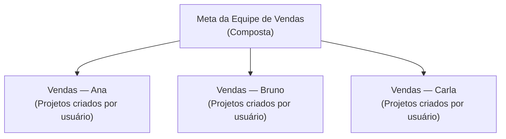

Uma **meta composta** não mede nada por conta própria: ela soma o progresso de outras metas, chamadas de **metas filhas**. É a forma ideal de consolidar resultados — por exemplo, juntar as metas individuais de cada vendedor em uma única meta de equipe.

<Info>
Pense na meta composta como um total geral: o número que ela mostra é a soma do progresso de todas as metas que você escolheu agrupar dentro dela.
</Info>

## Como funciona

<Steps>
<Step title="Você cria uma meta do tipo Composta">
  Ao escolher o tipo [Composta](/guides/goals/goal-types), aparece a opção de selecionar quais metas farão parte dela.
</Step>

<Step title="Escolhe as metas filhas">
  Selecione as metas que você quer somar. Elas continuam funcionando normalmente de forma independente — passam apenas a contribuir também para o total da composta.
</Step>

<Step title="A Olie soma o progresso">
  O progresso da meta composta passa a ser a soma do progresso de todas as metas filhas.

  <Check>
  Sempre que uma meta filha é atualizada, o total da composta é recalculado automaticamente.
  </Check>
</Step>
</Steps>

## Atualização em cadeia

Quando o progresso de uma meta filha muda, a meta composta que a contém é recalculada na hora. E se essa composta também fizer parte de outra composta maior, o novo valor sobe em cadeia até o topo.

<Info>
Isso significa que você pode montar estruturas em vários níveis — metas que somam metas que, por sua vez, somam outras metas — e todos os totais permanecem coerentes automaticamente.
</Info>

## Exemplo prático

Imagine que cada vendedor tem uma meta individual de projetos criados, e você quer acompanhar o total da equipe:

Conforme cada vendedor cria projetos, suas metas individuais avançam — e a meta da equipe reflete a soma de todos, sempre atualizada.

<Check>
Com uma única meta composta, você acompanha o resultado coletivo sem precisar somar números manualmente.
</Check>

## Regras e limitações

<AccordionGroup>
<Accordion title="Sem ciclos" icon="ban">
  Uma meta não pode fazer parte de si mesma, nem direta nem indiretamente. A Olie impede que você crie agrupamentos circulares (por exemplo, A dentro de B e B dentro de A).
</Accordion>

<Accordion title="Mesma unidade lógica" icon="scale-balanced">
  Como a composta apenas soma números, agrupe metas que façam sentido somar juntas. Misturar metas que medem coisas muito diferentes pode gerar um total sem significado prático.
</Accordion>

<Accordion title="Histórico apenas do futuro" icon="clock-rotate-left">
  Metas compostas geram histórico de períodos, mas **só dos ciclos que se encerram daqui para frente** — a Olie não reconstrói o passado, porque o valor depende do estado atual das metas filhas. Veja mais em [progresso e períodos](/guides/goals/tracking-progress#histórico-de-períodos).
</Accordion>

<Accordion title="Acompanhe os detalhes" icon="magnifying-glass">
  Nos detalhes de uma meta composta, você vê a lista de metas filhas com o progresso de cada uma. Para inspecionar uma filha a fundo, basta abrir os detalhes dela.
</Accordion>
</AccordionGroup>

<Tip>
Metas compostas são ótimas para visões gerenciais: crie metas individuais detalhadas para cada pessoa ou frente de trabalho e agrupe-as em uma composta para acompanhar o resultado consolidado.
</Tip>

[Veja como atualizar metas via automação →](/guides/goals/automation)
