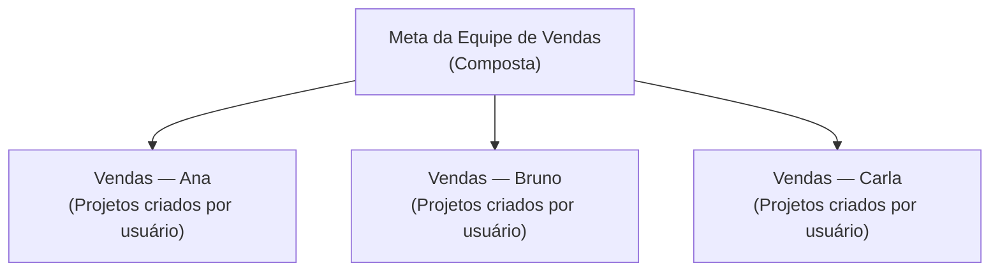

Uma **meta composta** não mede nada por conta própria: ela soma o progresso de outras metas, chamadas de **metas filhas**. Use a meta composta para consolidar resultados, por exemplo juntando as metas individuais de cada vendedor em uma única meta de equipe.

## Como funciona

Você monta uma meta composta em três passos:

<Steps>
<Step title="Crie uma meta do tipo Composta">
  Ao escolher o tipo [Composta](/guides/goals/goal-types), aparece a opção de selecionar quais metas farão parte dela.
</Step>

<Step title="Escolha as metas filhas">
  Selecione as metas que você quer somar. Elas continuam funcionando normalmente de forma independente — passam apenas a contribuir também para o total da composta.
</Step>

<Step title="Acompanhe a soma">
  O progresso da meta composta passa a ser a soma do progresso de todas as metas filhas.

  <Check>
  Sempre que uma meta filha é atualizada, o total da composta é recalculado automaticamente.
  </Check>
</Step>
</Steps>

## Atualização em cadeia

Quando o progresso de uma meta filha muda, a meta composta que a contém é recalculada na hora. Se essa composta também fizer parte de outra composta maior, o novo valor sobe em cadeia até o topo.

Por isso, você pode montar estruturas em vários níveis, com metas compostas que somam outras metas compostas, e todos os totais continuam coerentes.

## Exemplo prático

Imagine que cada vendedor tem uma meta individual de projetos criados, e você quer acompanhar o total da equipe:

```mermaid
flowchart TD
    A["Meta da Equipe de Vendas<br/>(Composta)"] --> B["Vendas — Ana<br/>(Projetos criados por usuário)"]
    A --> C["Vendas — Bruno<br/>(Projetos criados por usuário)"]
    A --> D["Vendas — Carla<br/>(Projetos criados por usuário)"]
```

Conforme cada vendedor cria projetos, as metas individuais avançam, e a meta da equipe mostra a soma de todas.

## Regras e limitações

Algumas regras valem para toda meta composta:

<AccordionGroup>
<Accordion title="Sem ciclos" icon="ban">
  Uma meta não pode fazer parte de si mesma, nem direta nem indiretamente. A Olie impede que você crie agrupamentos circulares (por exemplo, A dentro de B e B dentro de A).
</Accordion>

<Accordion title="Mesma unidade lógica" icon="scale-balanced">
  Como a composta apenas soma números, agrupe metas que façam sentido somar juntas. Misturar metas que medem coisas muito diferentes pode gerar um total sem significado prático.
</Accordion>

<Accordion title="Histórico apenas do futuro" icon="clock-rotate-left">
  Metas compostas geram histórico de períodos, mas **só dos ciclos que se encerram daqui para frente**. A Olie não reconstrói o passado, porque o valor depende do estado atual das metas filhas. Veja mais em [progresso e períodos](/guides/goals/tracking-progress#histórico-de-períodos).
</Accordion>

<Accordion title="Acompanhe os detalhes" icon="magnifying-glass">
  Nos detalhes de uma meta composta, você vê a lista de metas filhas com o progresso de cada uma. Para ver uma filha em detalhe, abra os detalhes dela.
</Accordion>
</AccordionGroup>

<Tip>
Para uma visão gerencial, crie metas individuais para cada pessoa ou frente de trabalho e agrupe-as em uma composta para acompanhar o resultado consolidado.
</Tip>

[Veja como atualizar metas via automação →](/guides/goals/automation)
