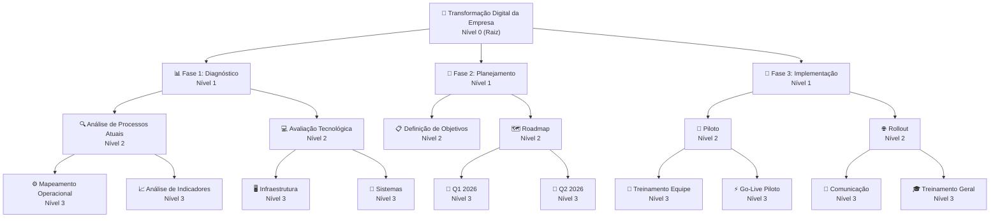

## O que é a hierarquia de projetos

A hierarquia de projetos permite organizar seus projetos em uma estrutura em árvore, onde um projeto pode ter outros projetos como dependentes. Esta funcionalidade é especialmente útil para projetos grandes que precisam ser divididos em partes menores para melhor gerenciamento.

<Info>
Imagine uma árvore genealógica, mas para projetos: você tem um projeto principal (pai) que pode ter vários projetos menores (filhos), e esses projetos filhos podem ter seus próprios projetos filhos.
</Info>

## Conceitos básicos

<CardGroup cols={2}>
<Card title="Projeto pai" icon="diagram-project">
  Um projeto que possui outros projetos como dependentes diretos. O projeto pai coordena e supervisiona os projetos filhos.
</Card>

<Card title="Projeto filho" icon="diagram-subtask">
  Um projeto que depende diretamente de um projeto pai. Projetos filhos são partes ou subdivisões do projeto pai.
</Card>

<Card title="Projeto raiz" icon="tree">
  Um projeto que não possui pai. É o projeto principal de uma estrutura hierárquica, o ponto de partida da árvore de projetos.
</Card>

<Card title="Projeto folha" icon="leaf">
  Um projeto que não possui filhos. É o projeto final de uma ramificação da hierarquia.
</Card>
</CardGroup>

### Níveis hierárquicos

A posição do projeto na estrutura:

<Steps>
<Step title="Nível 0 - Raiz">
  Projeto raiz sem pai, ponto de partida da hierarquia.
</Step>

<Step title="Nível 1 - Filho direto">
  Projeto filho direto do raiz.
</Step>

<Step title="Nível 2 - Neto">
  Projeto filho de um filho (neto do raiz).
</Step>

<Step title="Nível 3 - Bisneto">
  Projeto filho de um neto (máximo permitido).
  
  <Warning>
  Este é o último nível permitido pelo sistema.
  </Warning>
</Step>
</Steps>

## Regras e limitações

### Limite de níveis

<Card title="Profundidade máxima" icon="layer-group">
  O sistema permite até **4 níveis de profundidade** (0 a 3):
  
  - **Nível 0**: Projeto raiz
  - **Nível 1**: Filhos diretos
  - **Nível 2**: Netos
  - **Nível 3**: Bisnetos (último nível permitido)
  
  <Tip>
  Este limite mantém a estrutura organizacional simples e gerenciável, evitando hierarquias infinitas e complexas demais.
  </Tip>
</Card>

### Regras de relacionamento

O sistema verifica automaticamente estas regras e impede operações que as violariam:

<AccordionGroup>
<Accordion title="Mesmo ambiente" icon="building">
  Projetos pai e filho podem se relacionar com quaisquer projetos da mesma empresa.
</Accordion>

<Accordion title="Sem loops" icon="ban">
  Não é possível criar dependências circulares. Um projeto não pode ser pai de seu próprio pai.
  
  **Exemplo inválido:**
  - Projeto A é pai de Projeto B
  - Projeto B não pode ser pai de Projeto A
</Accordion>

<Accordion title="Sem auto-referência" icon="arrows-rotate">
  Um projeto não pode ser pai de si mesmo.
</Accordion>

<Accordion title="Respeitar limite de profundidade" icon="ruler-vertical">
  Não é possível adicionar filhos se isso ultrapassar o limite de 3 níveis de profundidade.
</Accordion>
</AccordionGroup>

## Funcionalidades disponíveis

### Visualizar estrutura

<Tabs>
<Tab title="Filhos diretos">
  Visualize todos os projetos que dependem diretamente de um projeto específico.
  
  ```mermaid
  flowchart TD
      A[Shopping Center] --> B[Fundação]
      A --> C[Estrutura]
      A --> D[Acabamento]
  ```
</Tab>

<Tab title="Árvore completa">
  Visualize toda a estrutura hierárquica, desde o projeto raiz até todos os projetos filhos, netos e bisnetos.
  
  ```mermaid
  flowchart TD
      A[Shopping Center] --> B[Fundação]
      A --> C[Estrutura]
      A --> D[Acabamento]
      B --> B1[Escavação]
      B --> B2[Concretagem]
      C --> C1[Pilares]
      C --> C2[Lajes]
      D --> D1[Pintura]
      D --> D2[Revestimento]
  ```
</Tab>

<Tab title="Caminho hierárquico">
  Veja o caminho completo desde o projeto raiz até o projeto atual.
  
  **Exemplo:**
  `Shopping Center > Fundação > Escavação`
  
  <Info>
  Nos detalhes do projeto, o código é exibido com seus antecessores em formato de caminho (exemplo: "P1 > P2 > P3").
  </Info>
</Tab>
</Tabs>

### Modificar estrutura

<Steps>
<Step title="Anexar projeto filho">
  Transforme um projeto independente em filho de outro projeto.
  
  <Check>
  O projeto filho herda o contexto e a organização do projeto pai.
  </Check>
</Step>

<Step title="Remover projeto filho">
  Transforme um projeto filho em projeto independente, promovendo-o a raiz.
  
  <Note>
  Ao promover um projeto a raiz, todos os seus filhos mantêm a estrutura hierárquica relativa.
  </Note>
</Step>

<Step title="Mover projeto">
  Mova um projeto de um pai para outro, reorganizando a estrutura.
  
  <Warning>
  Verifique se a movimentação não violará o limite de profundidade antes de confirmar.
  </Warning>
</Step>
</Steps>

## Benefícios da hierarquia

<CardGroup cols={2}>
<Card title="Organização clara" icon="sitemap">
  Estrutura visual clara dos relacionamentos entre projetos, facilitando a compreensão de dependências.
</Card>

<Card title="Gestão eficiente" icon="chart-gantt">
  Controle centralizado de projetos relacionados com análises consolidadas de progresso e recursos.
</Card>

<Card title="Flexibilidade" icon="arrows-split-up-and-left">
  Reorganização fácil da estrutura conforme necessário, adaptando-se a mudanças no escopo.
</Card>

<Card title="Relatórios melhorados" icon="chart-line">
  Visão macro de toda a estrutura organizacional com análises de impacto em projetos relacionados.
</Card>

<Card title="Comunicação" icon="comments">
  Melhora a comunicação entre equipes através da clareza na estrutura organizacional.
</Card>

<Card title="Tomada de decisão" icon="lightbulb">
  Decisões baseadas na visão completa da estrutura de projetos e suas interdependências.
</Card>
</CardGroup>

## Casos de uso comuns

<Tabs>
<Tab title="Desenvolvimento de software">
  **Divisão de sistemas complexos em módulos**
  
  ```mermaid
  flowchart TD
      A[Sistema ERP] --> B[Módulo Financeiro]
      A --> C[Módulo RH]
      A --> D[Módulo Estoque]
      B --> B1[Contas a Pagar]
      B --> B2[Contas a Receber]
      B --> B3[Fluxo de Caixa]
      C --> C1[Folha de Pagamento]
      C --> C2[Gestão de Férias]
      D --> D1[Controle de Entrada]
      D --> D2[Controle de Saída]
  ```
  
  - Controle de versões e releases
  - Gestão de equipes especializadas
  - Entregas incrementais
</Tab>

<Tab title="Construção civil">
  **Organização de grandes obras**
  
  ```mermaid
  flowchart TD
      A[Edifício Residencial] --> B[Infraestrutura]
      A --> C[Superestrutura]
      A --> D[Acabamento]
      B --> B1[Terraplenagem]
      B --> B2[Fundação]
      B --> B3[Contenção]
      C --> C1[Estrutura]
      C --> C2[Alvenaria]
      D --> D1[Instalações]
      D --> D2[Revestimentos]
  ```
  
  - Controle de etapas construtivas
  - Gestão de equipes por especialidade
  - Acompanhamento de cronograma físico
</Tab>

<Tab title="Consultoria">
  **Projetos por área de expertise**
  
  ```mermaid
  flowchart TD
      A[Transformação Digital] --> B[Diagnóstico]
      A --> C[Estratégia]
      A --> D[Implementação]
      B --> B1[Análise de Processos]
      B --> B2[Mapeamento Tecnológico]
      C --> C1[Planejamento]
      C --> C2[Roadmap]
      D --> D1[Fase Piloto]
      D --> D2[Rollout]
  ```
  
  - Controle de diferentes áreas
  - Gestão multidisciplinar
  - Entregas por fase
</Tab>

<Tab title="Marketing">
  **Campanhas e eventos**
  
  ```mermaid
  flowchart TD
      A[Lançamento de Produto] --> B[Pré-lançamento]
      A --> C[Lançamento]
      A --> D[Pós-lançamento]
      B --> B1[Teaser]
      B --> B2[PR]
      C --> C1[Evento]
      C --> C2[Mídia]
      D --> D1[Remarketing]
      D --> D2[Análise de Resultados]
  ```
  
  - Organização de campanhas por canal
  - Controle de fases de lançamento
  - Gestão de múltiplos eventos
</Tab>
</Tabs>

## Dicas de uso

### Planejamento da estrutura

<AccordionGroup>
<Accordion title="1. Identifique o projeto principal">
  Determine qual será seu projeto raiz. Este deve ser o projeto mais abrangente que engloba todos os outros.
</Accordion>

<Accordion title="2. Defina as divisões principais">
  Identifique as áreas ou fases principais que serão os filhos diretos do projeto raiz.
</Accordion>

<Accordion title="3. Considere a profundidade">
  Lembre-se do limite de 4 níveis. Planeje a estrutura de forma que não ultrapasse este limite.
  
  <Tip>
  Se precisar de mais níveis, considere criar múltiplas árvores de projetos separadas.
  </Tip>
</Accordion>

<Accordion title="4. Mantenha a flexibilidade">
  Estruturas podem ser reorganizadas conforme necessário. Não tenha medo de ajustar a hierarquia ao longo do projeto.
</Accordion>
</AccordionGroup>

### Nomenclatura

<CardGroup cols={2}>
<Card title="Nomes claros" icon="tag">
  Use nomes descritivos que deixem clara a função de cada projeto na estrutura.
</Card>

<Card title="Consistência" icon="check-double">
  Mantenha consistência na nomenclatura entre projetos do mesmo nível.
</Card> 

<Card title="Hierarquia visível" icon="eye">
  O nome deve refletir a posição na hierarquia quando possível.
</Card>
</CardGroup>

### Manutenção

<Steps>
<Step title="Revise periodicamente">
  Revise a estrutura regularmente para garantir que ainda reflete a organização atual do trabalho.
</Step>

<Step title="Reorganize quando necessário">
  Não hesite em reorganizar a estrutura quando mudanças no escopo exigirem.
  
  <Note>
  Reorganizações são operações seguras e não afetam o conteúdo dos projetos.
  </Note>
</Step>

<Step title="Mantenha atualizada">
  Garanta que a estrutura esteja sempre sincronizada com a realidade do projeto.
</Step>

<Step title="Documente mudanças">
  Registre as razões para reorganizações importantes na estrutura.
</Step>
</Steps>

## Exemplo prático completo

Vamos ver um exemplo completo de hierarquia de projetos:



<Check>
Esta estrutura oferece organização clara, permite acompanhamento detalhado de cada fase e facilita a gestão de equipes especializadas.
</Check>

## Conclusão

A hierarquia de projetos é uma ferramenta poderosa para organizar e gerenciar projetos complexos. Com ela, você pode criar estruturas claras, manter o controle organizacional e obter visões consolidadas de seus projetos relacionados.

<Tip>
Aproveite essa funcionalidade para melhorar a organização, comunicação e eficiência no gerenciamento de seus projetos, criando estruturas que reflitam a realidade de sua organização.
</Tip>

[Aprenda a automatizar a criação de hierarquias →](/guides/automation/automated-hierarchy)
