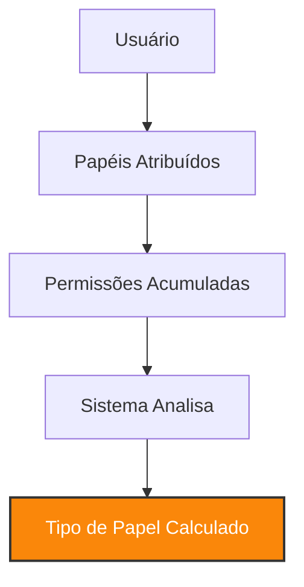

## O que são tipos de papéis

Os **Tipos de Papéis** são categorias que ajudam a organizar os usuários no sistema com base nas permissões que possuem. Eles definem o nível de acesso e as funções desempenhadas por cada usuário, tornando o gerenciamento mais claro e eficiente.

<Info>
Os tipos de papéis são **calculados automaticamente** pelo sistema. Você não precisa configurá-los manualmente.
</Info>

## Como funcionam os tipos de papéis

### Classificação automática

O sistema analisa continuamente as permissões atribuídas a cada usuário e os classifica automaticamente no tipo de papel mais adequado.

<Steps>
<Step title="Atribuição de papéis">
Você atribui um ou mais papéis ao usuário normalmente.
</Step>

<Step title="Análise automática">
O sistema soma todas as permissões dos papéis atribuídos ao usuário.

<Note>
Se um usuário tem múltiplos papéis, todas as permissões são consideradas no cálculo.
</Note>
</Step>

<Step title="Classificação">
Com base no total de permissões, o sistema classifica o usuário em um dos tipos de papéis disponíveis.

<Check>
A classificação é atualizada automaticamente sempre que os papéis ou permissões do usuário mudam.
</Check>
</Step>
</Steps>

### Permissões mínimas

Cada tipo de papel possui um conjunto de permissões mínimas necessárias para que o usuário seja classificado nele.
<AccordionGroup>
  <Accordion title="Operacional" icon="user">
    **Nível restrito de execução**
    
    - Visualizar lista de funis de projeto (apenas aqueles com acesso liberado).
    - Execução de tarefas cotidianas sem permissão para alteração de fluxos.
    - Acesso restrito a funções administrativas ou de configuração.
    
    **Ideal para:** Colaboradores que operam no dia a dia da empresa mas não editam os processos.
  </Accordion>

  <Accordion title="Gerencial" icon="user-gear">
    **Gestão e configuração de processos**
    
    - Todas as permissões de operação e supervisão.
    - Criar e arquivar funis de projeto.
    - Editar e configurar funis e etapas de processos.
    - Visualizar todos os funis de projeto da organização.
    
    **Ideal para:** Líderes responsáveis por montar e gerenciar as configurações dos processos internos.
  </Accordion>

  <Accordion title="Sócio" icon="user-shield">
    **Controle total e estratégico**
    
    - Conjunto mais amplo de permissões, abrangendo todas as áreas administrativas e estratégicas.
    - Exportar planilhas de projetos, clientes e contatos.
    - Visualizar lista completa de clientes e contatos.
    - Criar, editar, arquivar e visualizar todos os funis e projetos sem restrições.
    - Acesso total à inteligência de dados da plataforma.
    
    **Ideal para:** Administradores, diretores e configuradores master do sistema.
  </Accordion>
</AccordionGroup>

### Cobrança baseada em tipos

Os tipos de papéis têm custos associados, usados para calcular os valores cobrados com base na quantidade de usuários em cada categoria.

## Exemplo prático de classificação

Vamos ver como funciona na prática com a nova hierarquia:

<Tabs>
<Tab title="Cenário 1: Operador">
**João - Assistente de Operações**

Papéis atribuídos:

* "Operação" (Visualizar tarefas atribuídas)

**Permissões totais:** Acesso restrito a funis específicos.

**Tipo calculado:** Operacional ✓ 

<Check>
João não possui permissões de edição de fluxo e será classificado como Operacional.
</Check>
</Tab>

<Tab title="Cenário 2: Gestor">
**Maria - Coordenadora de Processos**

Papéis atribuídos:

* "Configurador de Funis" (Criar e Editar funis).

**Permissões totais:** Gerenciamento de processos.

**Tipo calculado:** Gerencial ✓ 

<Info>
Ao receber permissão para editar um funil, a classificação de Maria sobe automaticamente para Gerencial.
</Info>
</Tab>

<Tab title="Cenário 3: Diretor">
**Carlos - CEO**

Papéis atribuídos:

* "Administrador Master" (Exportar dados, Ver todos os projetos).

**Permissões totais:** Controle estratégico completo.

**Tipo calculado:** Sócio ✓ 

<Warning>
Carlos tem acesso a dados sensíveis de exportação, o que o classifica automaticamente como Sócio.
</Warning>
</Tab>
</Tabs>

## Otimizando custos com tipos de papéis

<CardGroup cols={2}>
<Card title="Revise permissões" icon="magnifying-glass">
Verifique se o usuário realmente precisa exportar dados ou editar funis para evitar upgrades indesejados de tipo.
</Card>

<Card title="Use papéis específicos" icon="bullseye">
Crie papéis que limitem o acesso apenas ao necessário para manter o colaborador no tipo Operacional quando possível.
</Card>

<Card title="Monitore classificações" icon="chart-line">
Acompanhe se a promoção de um usuário para "Gerencial" não excederá seu limite de licenças contratadas.
</Card>

<Card title="Planeje crescimento" icon="seedling">
Lembre-se que cada expansão de usuários ativos pode renovar seu contrato por mais 12 meses.
</Card>
</CardGroup>

## Visualizando tipos de papéis

No painel de usuários, você pode ver claramente o tipo de papel de cada usuário e a ocupação das licenças:

<Frame>

<h4>Exemplo de listagem de usuários:</h4>
<ul style={{listStyle: 'none', padding: 0}}>
<li>👤 João Silva - Operacional</li>
<li>👤 Maria Santos - Gerencial</li>
<li>👤 Carlos Oliveira - Sócio</li>
</ul>

</Frame>

## Perguntas frequentes

<AccordionGroup>
<Accordion title="O sistema bloqueia a mudança de papel?">
Sim. Se você tentar atribuir uma permissão que mude o tipo de papel do usuário (ex: de Operacional para Gerencial) e o limite de licenças contratadas estiver esgotado, o sistema não permitirá salvar a alteração.
</Accordion>

<Accordion title="Posso trocar um usuário por outro sem custo?">
Sim. Você pode inativar um usuário e ativar outro para ocupar a mesma "cadeira" ou licença disponível sem alterar o valor da mensalidade.
</Accordion>

<Accordion title="Por que não consigo definir o tipo manualmente?">
O tipo é um reflexo direto das permissões. Para mudar o tipo, você deve gerenciar os papéis e permissões do usuário; o sistema recalcula a categoria instantaneamente.
</Accordion>

<Accordion title="O que fazer se o sistema der erro de limite ao trocar permissões?">
Caso o limite esteja em 100%, você deve entrar em contato com o suporte ou gerência de conta para solicitar a troca manual de uma licença de um tipo por outro ou realizar um upgrade.
</Accordion>

<Accordion title="O tipo de papel não aparece no usuário">
Caso o tipo de papel não apareça no usuário, você deve verificar se o usuário possui permissões suficientes para ser classificado no tipo de papel desejado, acontece quando o usuário não possui nenhuma permissão. Se o usuário possui permissões suficientes, o tipo de papel será calculado automaticamente.
</Accordion>

<Accordion title="Usuários inativos ocupam uma licença por tipo de papel?">
Não. Usuários inativos não ocupam uma licença por tipo de papel.
</Accordion>
</AccordionGroup>

## Conclusão

Com os **Tipos de Papéis**, o gerenciamento de permissões e custos ocorre de forma integrada e automática.

<Check>
Mantenha suas permissões organizadas e o sistema cuidará da classificação de faturamento para você! 
</Check>
