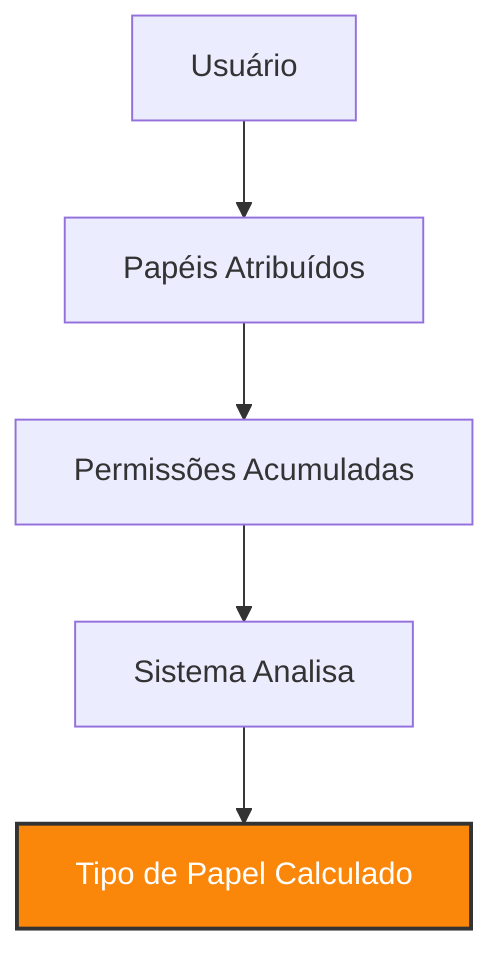

Esta página explica como a Olie classifica cada usuário em um tipo de papel (operacional, gerencial ou sócio) a partir das permissões dele. Ela mostra também como essa classificação afeta as licenças e o custo da assinatura.

## O que são tipos de papéis

Os **tipos de papéis** são categorias que organizam os usuários de acordo com as permissões que eles têm. Cada tipo indica um nível de acesso e as funções que o usuário exerce.

Os tipos de papéis são **calculados automaticamente** pela Olie. Você não os configura: para mudar o tipo de um usuário, mude os papéis ou as permissões dele.

## Como funcionam os tipos de papéis

### Classificação automática

A Olie analisa as permissões atribuídas a cada usuário e o classifica automaticamente no tipo de papel correspondente.

```mermaid
graph TD
    A[Usuário] --> B[Papéis Atribuídos]
    B --> C[Permissões Acumuladas]
    C --> D[Sistema Analisa]
    D --> E[Tipo de Papel Calculado]
    
    style E fill:#FA870A,stroke:#333,stroke-width:2px,color:#fff

```

A classificação acontece em três etapas:

<Steps>
<Step title="Atribuição de papéis">
Você atribui um ou mais papéis ao usuário normalmente.
</Step>

<Step title="Análise automática">
A Olie soma as permissões de todos os papéis atribuídos ao usuário. Se ele tem vários papéis, todas as permissões entram no cálculo.
</Step>

<Step title="Classificação">
Com base no total de permissões, a Olie classifica o usuário em um dos tipos de papéis.

<Check>
A classificação é atualizada automaticamente sempre que os papéis ou permissões do usuário mudam.
</Check>
</Step>
</Steps>

### Permissões mínimas

Cada tipo de papel tem um conjunto de permissões mínimas para que o usuário seja classificado nele.

<AccordionGroup>
  <Accordion title="Operacional" icon="user">
    **Nível restrito de execução**
    
    - Visualizar a lista de funis de projeto, apenas os que têm acesso liberado.
    - Executar tarefas do dia a dia, sem permissão para alterar fluxos.
    - Acessar de forma restrita as funções administrativas ou de configuração.
    
    **Ideal para:** Colaboradores que operam no dia a dia da empresa mas não editam os processos.
  </Accordion>

  <Accordion title="Gerencial" icon="user-gear">
    **Gestão e configuração de processos**
    
    - Todas as permissões de operação e supervisão.
    - Criar e arquivar funis de projeto.
    - Editar e configurar funis e etapas de processos.
    - Visualizar todos os funis de projeto da organização.
    
    **Ideal para:** Líderes responsáveis por montar e gerenciar as configurações dos processos internos.
  </Accordion>

  <Accordion title="Sócio" icon="user-shield">
    **Controle total e estratégico**
    
    - Conjunto mais amplo de permissões, abrangendo todas as áreas administrativas e estratégicas.
    - Exportar planilhas de projetos, clientes e contatos.
    - Visualizar lista completa de clientes e contatos.
    - Criar, editar, arquivar e visualizar todos os funis e projetos sem restrições.
    - Acesso total à inteligência de dados da plataforma.
    
    **Ideal para:** Administradores, diretores e configuradores master do sistema.
  </Accordion>
</AccordionGroup>

### Cobrança baseada em tipos

Cada tipo de papel tem um custo, e o valor da assinatura considera quantas licenças de cada tipo a empresa tem. Veja como o valor é composto em [Assinatura e licenças](/guides/billing/subscription-and-licenses).

## Exemplo prático de classificação

Os três cenários abaixo mostram como os papéis atribuídos levam a cada tipo:

<Tabs>
<Tab title="Cenário 1: Operador">
**João - Assistente de Operações**

Papéis atribuídos:

* "Operação" (Visualizar tarefas atribuídas)

**Permissões totais:** Acesso restrito a funis específicos.

**Tipo calculado:** Operacional ✓ 

<Check>
João não possui permissões de edição de fluxo e será classificado como Operacional.
</Check>
</Tab>

<Tab title="Cenário 2: Gestor">
**Maria - Coordenadora de Processos**

Papéis atribuídos:

* "Configurador de Funis" (Criar e Editar funis).

**Permissões totais:** Gerenciamento de processos.

**Tipo calculado:** Gerencial ✓ 

<Info>
Ao receber permissão para editar um funil, a classificação de Maria sobe automaticamente para Gerencial.
</Info>
</Tab>

<Tab title="Cenário 3: Diretor">
**Carlos - Diretor-presidente**

Papéis atribuídos:

* "Administrador Master" (Exportar dados, Ver todos os projetos).

**Permissões totais:** Controle estratégico completo.

**Tipo calculado:** Sócio ✓ 

<Warning>
Carlos tem acesso a dados sensíveis de exportação, o que o classifica automaticamente como Sócio.
</Warning>
</Tab>
</Tabs>

## Otimizando custos com tipos de papéis

Como cada permissão pode mudar o tipo de papel, a forma de montar os papéis afeta o custo:

<CardGroup cols={2}>
<Card title="Revise permissões" icon="magnifying-glass">
Verifique se o usuário realmente precisa exportar dados ou editar funis para evitar upgrades indesejados de tipo.
</Card>

<Card title="Use papéis específicos" icon="bullseye">
Crie papéis que limitem o acesso apenas ao necessário para manter o colaborador no tipo Operacional quando possível.
</Card>

<Card title="Monitore classificações" icon="chart-line">
Acompanhe se a promoção de um usuário para "Gerencial" não excederá seu limite de licenças contratadas.
</Card>

<Card title="Planeje crescimento" icon="seedling">
Lembre-se que cada expansão de usuários ativos pode renovar seu contrato por mais 12 meses.
</Card>
</CardGroup>

## Visualizando tipos de papéis

No painel de usuários, você vê o tipo de papel de cada usuário (por exemplo, João Silva como Operacional e Maria Santos como Gerencial) e a ocupação das licenças.

## Perguntas frequentes

As dúvidas mais comuns sobre tipos de papéis e licenças:

<AccordionGroup>
<Accordion title="O sistema bloqueia a mudança de papel?">
Sim, quando o limite de licenças contratadas está esgotado. Nesse caso, a Olie não salva uma permissão que mude o tipo de papel do usuário (por exemplo, de Operacional para Gerencial).
</Accordion>

<Accordion title="Posso trocar um usuário por outro sem custo?">
Sim. Você pode desabilitar um usuário e habilitar outro para ocupar a mesma licença, sem alterar o valor da assinatura.
</Accordion>

<Accordion title="Por que não consigo definir o tipo manualmente?">
O tipo é um reflexo direto das permissões. Para mudar o tipo, altere os papéis ou as permissões do usuário. A Olie recalcula o tipo na hora.
</Accordion>

<Accordion title="O que fazer se o sistema der erro de limite ao trocar permissões?">
Esse erro aparece quando o limite de licenças contratadas está em 100%. Para resolver, ajuste as licenças da assinatura com uma destas opções:

- troque uma licença de um tipo por outro, adicionando uma licença do tipo novo e removendo uma do tipo antigo;
- contrate mais licenças do tipo necessário (upgrade).

Quem tem permissão para alterar a assinatura faz esse ajuste sem falar com o suporte. Veja como em [Ajustar suas licenças](/guides/billing/trial-and-subscription-flow#ajustar-suas-licenças).
</Accordion>

<Accordion title="O tipo de papel não aparece no usuário">
O tipo de papel não aparece quando o usuário não tem nenhuma permissão. Atribua a ele um papel com as permissões do tipo desejado, e a Olie calcula o tipo automaticamente.
</Accordion>

<Accordion title="Usuários inativos ocupam uma licença por tipo de papel?">
Não. Usuários inativos não ocupam uma licença por tipo de papel.
</Accordion>
</AccordionGroup>

## Próximos passos

Continue por estas páginas:

- [Papéis e permissões](/guides/users/roles-permissions): monte os papéis que definem o tipo de cada usuário.
- [Trial e fluxo de assinatura](/guides/billing/trial-and-subscription-flow#ajustar-suas-licenças): adicione, remova ou troque licenças.
