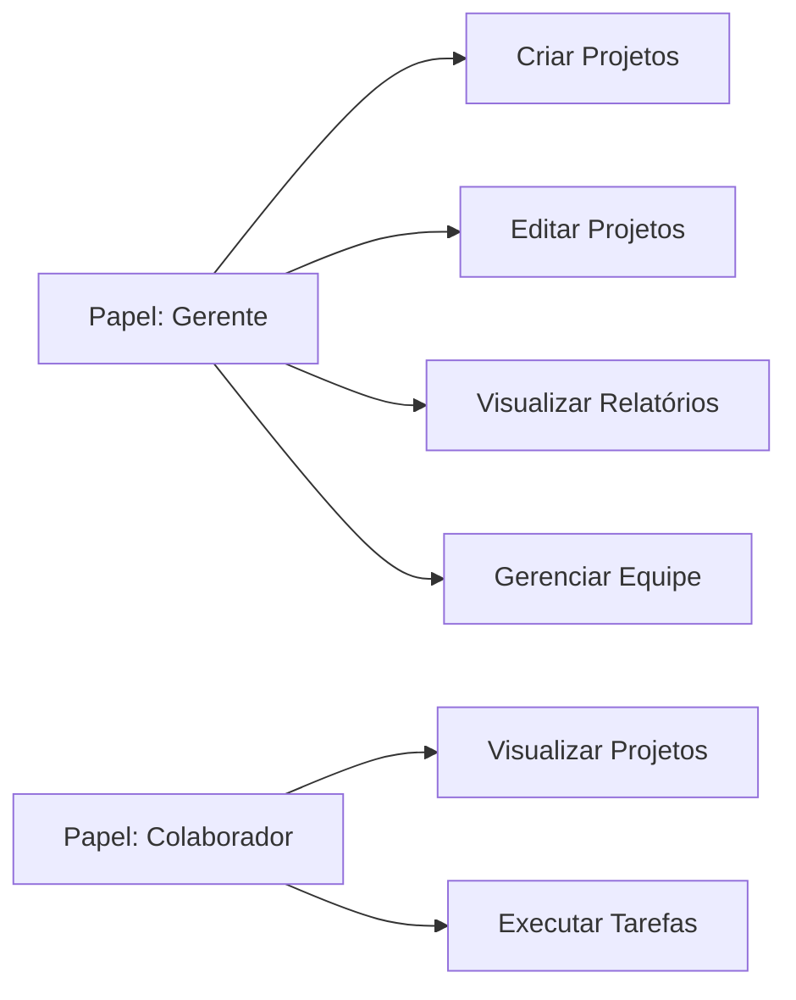

## O que são papéis e permissões

O sistema de **Papéis** e **Permissões** permite gerenciar o acesso e as ações dos usuários dentro da plataforma de forma personalizada e eficiente, oferecendo flexibilidade para configurar as permissões necessárias para cada função.

<CardGroup cols={2}>
<Card title="Papéis" icon="user-tag">
  Representam funções ou cargos atribuídos aos usuários, como "Administrador", "Editor" ou "Colaborador". Cada papel agrupa um conjunto de permissões específicas.
</Card>

<Card title="Permissões" icon="key">
  Ações que podem ser realizadas no sistema, como "Criar Projeto", "Editar Usuários" ou "Visualizar Relatórios". São pré-definidas e atribuídas aos papéis.
</Card>
</CardGroup>

## Como funciona o sistema

### 1. Papéis personalizáveis

O proprietário da empresa pode criar papéis personalizados de acordo com a estrutura e necessidades da organização.

<Info>
Um papel pode representar um nível de responsabilidade (como "Gerente") ou uma função específica (como "Analista de Dados").
</Info>

<Steps>
<Step title="Identifique as necessidades">
  Determine quais funções ou cargos existem na sua organização e que tipo de acesso cada um precisa.
</Step>

<Step title="Crie os papéis">
  Crie papéis com nomes descritivos que reflitam claramente a função ou responsabilidade.
  
  <Tip>
  Use nomes consistentes e intuitivos como "Gerente de Projetos", "Designer" ou "Desenvolvedor".
  </Tip>
</Step>

<Step title="Atribua permissões">
  Selecione as permissões apropriadas para cada papel baseando-se nas responsabilidades da função.
</Step>
</Steps>

### 2. Permissões pré-definidas

O sistema fornece uma lista de permissões fixas que cobrem todas as operações possíveis na plataforma.

<AccordionGroup>
<Accordion title="Exemplos de permissões" icon="list-check">
  - **Visualizar Relatórios**: Permite acesso aos relatórios do sistema
  - **Criar Projetos**: Permite criar novos projetos
  - **Editar Usuários**: Permite modificar informações de usuários
  - **Criar Convites**: Permite convidar novos usuários
  - **Gerenciar Permissões**: Permite configurar papéis e permissões
  - **Executar Automações**: Permite criar e executar automações
</Accordion>

<Accordion title="Categorias de permissões" icon="layer-group">
  As permissões são organizadas em categorias lógicas:
  
  - **Gestão de Projetos**: Criar, editar, excluir projetos
  - **Gestão de Usuários**: Convidar, editar, desabilitar usuários 
  - **Automação**: Criar e gerenciar automações
  - **Configurações**: Modificar configurações da empresa
</Accordion>
</AccordionGroup>

### 3. Vinculação de papéis e permissões

Cada papel pode ter uma ou mais permissões atribuídas, oferecendo flexibilidade total no controle de acesso.

<Note>
Um único papel pode abranger permissões de diferentes áreas do sistema, dependendo do que for necessário para aquela função.
</Note>

### 4. Usuários com múltiplos papéis

Um usuário pode ter múltiplos papéis atribuídos, acumulando as permissões de todos eles.

<Tabs>
<Tab title="Como funciona">
  Quando um usuário possui múltiplos papéis, ele recebe **todas as permissões** de cada um deles.
  
  **Exemplo:**
  - Papel "Gerente" tem: Criar Projetos, Editar Projetos
  - Papel "Editor" tem: Editar Conteúdo, Revisar Textos
  - Usuário com ambos os papéis tem: Todas as 4 permissões
</Tab>

<Tab title="Casos de uso">
  Múltiplos papéis são úteis quando:
  
  - Um usuário tem responsabilidades híbridas
  - Você quer adicionar permissões temporárias
  - A função combina diferentes áreas de atuação
  
  <Tip>
  Use múltiplos papéis em vez de criar papéis muito específicos para cada combinação possível de permissões.
  </Tip>
</Tab>

<Tab title="Exemplo prático">
  **Cenário:** Maria é Gerente de Projetos e também responsável por revisar conteúdo.
  
  - Papel 1: "Gerente de Projetos"
    - Criar/Editar Projetos
    - Gerenciar Equipe
    - Visualizar Relatórios
  
  - Papel 2: "Editor de Conteúdo"
    - Editar Conteúdo
    - Revisar Textos
    - Publicar Artigos
  
  **Resultado:** Maria tem todas as 6 permissões combinadas.
</Tab>
</Tabs>

## Tipos de papéis

Os **Tipos de Papéis** classificam os usuários com base em suas permissões e funções no sistema. Cada tipo reflete um nível de responsabilidade e possui permissões mínimas associadas.

<Warning>
Os tipos de papéis são calculados **automaticamente pelo sistema** com base nas permissões atribuídas. Não requerem ação manual do usuário.
</Warning>

<Card title="Importante sobre custos" icon="dollar-sign">
  Os tipos de papéis são utilizados para calcular os custos relacionados ao uso do sistema, tornando o gerenciamento de acessos e cobranças mais claro e eficiente.
</Card>

[Leia mais sobre Tipos de Papéis →](/guides/users/role-types)

## Benefícios do sistema

<CardGroup cols={3}>
<Card title="Controle granular" icon="sliders">
  Configure exatamente quais ações cada usuário pode realizar, sem precisar dar acesso total.
</Card>

<Card title="Segurança" icon="lock">
  Limite o acesso a informações sensíveis apenas para quem realmente precisa.
</Card>

<Card title="Flexibilidade" icon="wand-magic-sparkles">
  Combine múltiplos papéis para criar perfis de acesso personalizados.
</Card>

<Card title="Escalabilidade" icon="up-right-and-down-left-from-center">
  Crie papéis uma vez e atribua a múltiplos usuários facilmente.
</Card>

<Card title="Auditoria" icon="clipboard-list">
  Mantenha controle claro de quem tem acesso a quê na organização.
</Card>

<Card title="Simplicidade" icon="circle-check">
  Interface intuitiva para gerenciar permissões sem complexidade técnica.
</Card>
</CardGroup>

## Melhores práticas

<AccordionGroup>
<Accordion title="Princípio do menor privilégio">
  Atribua apenas as permissões necessárias para cada papel. Comece com menos permissões e adicione conforme necessário. O sistema normalmente indica qual permissão o usuário precisa para acessar determinada funcionalidade.
</Accordion>

<Accordion title="Papéis baseados em funções">
  Crie papéis baseados em funções reais da organização, não em indivíduos específicos.
</Accordion>

<Accordion title="Revisão periódica">
  Revise regularmente os papéis e permissões para garantir que continuam apropriados.
</Accordion>

<Accordion title="Documentação clara">
  Mantenha descrições claras do que cada papel pode fazer para facilitar atribuições futuras.
</Accordion>

<Accordion title="Testes de permissões">
  Teste os papéis criados para garantir que as permissões funcionam como esperado.
</Accordion>
</AccordionGroup>

## Conclusão

Com o sistema de **Papéis e Permissões**, o controle de acesso é centralizado, seguro e flexível, permitindo que a organização configure a plataforma para atender às suas necessidades específicas com precisão e eficiência.

<Check>
Um sistema bem configurado de papéis e permissões é fundamental para a segurança e eficiência operacional da organização.
</Check>
