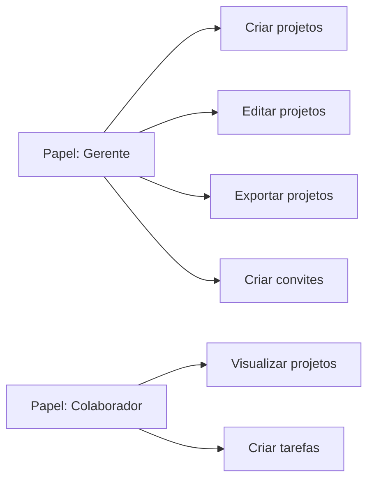

Esta página explica como os papéis e as permissões definem o que cada usuário pode ver e fazer na sua empresa da Olie. Ela mostra também como montar papéis para a sua equipe. Para convidar pessoas, veja [Gerenciamento de usuários](/guides/users/user-management).

## O que são papéis e permissões

Com **papéis** e **permissões**, você define o acesso e as ações de cada usuário na plataforma, de acordo com a função que ele exerce.

<CardGroup cols={2}>
<Card title="Papéis" icon="user-tag">
  Representam funções ou cargos atribuídos aos usuários, como "Administrador", "Editor" ou "Colaborador". Cada papel agrupa um conjunto de permissões específicas.
</Card>

<Card title="Permissões" icon="key">
  Ações que podem ser realizadas no sistema, como criar projetos, editar usuários ou exportar projetos. São pré-definidas e atribuídas aos papéis.
</Card>
</CardGroup>

## Como funciona o sistema

O sistema tem quatro partes, descritas a seguir.

### Papéis personalizáveis

Quem tem a permissão de gerenciar papéis e permissões pode criar papéis personalizados de acordo com a estrutura e as necessidades da organização. O papel **Property**, do proprietário da empresa, tem essa permissão por padrão, mas você pode dá-la a outros papéis. Um papel pode representar um nível de responsabilidade (como "Gerente") ou uma função específica (como "Analista de Dados").

<Steps>
<Step title="Identifique as necessidades">
  Determine quais funções ou cargos existem na sua organização e que tipo de acesso cada um precisa.
</Step>

<Step title="Crie os papéis">
  Em **Ajustes** > **Papéis**, crie papéis com nomes que descrevam a função ou a responsabilidade, como "Gerente de Projetos", "Designer" ou "Desenvolvedor". Mantenha o mesmo padrão de nome em todos os papéis.
</Step>

<Step title="Atribua permissões">
  Selecione as permissões apropriadas para cada papel baseando-se nas responsabilidades da função.
</Step>
</Steps>

### Permissões pré-definidas

A Olie fornece uma lista fixa de permissões, que cobre as operações da plataforma. Você não cria permissões novas: escolhe quais delas cada papel recebe.

<AccordionGroup>
<Accordion title="Exemplos de permissões" icon="list-check">
  Alguns exemplos, descritos pelo que cada permissão libera:

  - Criar projetos: permite criar novos projetos.
  - Editar usuários: permite alterar as informações dos usuários.
  - Criar convites: permite convidar novas pessoas para a empresa.
  - Gerenciar papéis e permissões: permite criar papéis e escolher as permissões de cada um.
  - Criar automações: permite criar novas automações.
  - Exportar projetos: permite exportar a lista de projetos em planilha.
</Accordion>

<Accordion title="Categorias de permissões" icon="layer-group">
  As permissões são organizadas em categorias lógicas:
  
  - **Gestão de Projetos**: Criar, editar, excluir projetos
  - **Gestão de Usuários**: Convidar, editar, desabilitar usuários 
  - **Automação**: Criar e gerenciar automações
  - **Configurações**: Modificar configurações da empresa
  - **Canais**: Visualizar, criar, editar e arquivar os canais de conversa dos projetos
  - **Integrações**: Visualizar, criar, editar e remover integrações, como o WhatsApp
</Accordion>
</AccordionGroup>

<Note>
Canais e integrações estão disponíveis para todas as empresas, mas cada pessoa só consegue usá-los se o papel dela tiver as permissões dos grupos **Canais** e **Integrações**. O papel **Property** já tem todas; nos papéis criados pela sua empresa, você precisa marcá-las.
</Note>

### Vinculação de papéis e permissões

Cada papel pode ter uma ou mais permissões atribuídas.

```mermaid
graph LR
    A[Papel: Gerente] --> B[Criar projetos]
    A --> C[Editar projetos]
    A --> D[Exportar projetos]
    A --> E[Criar convites]
    
    F[Papel: Colaborador] --> G[Visualizar projetos]
    F --> H[Criar tarefas]
```

Um único papel pode reunir permissões de diferentes áreas da plataforma, conforme o que a função exige.

### Usuários com múltiplos papéis

Um usuário pode ter múltiplos papéis atribuídos, acumulando as permissões de todos eles.

<Tabs>
<Tab title="Como funciona">
  Quando um usuário possui múltiplos papéis, ele recebe **todas as permissões** de cada um deles.
  
  **Exemplo:**
  - Papel "Gerente" tem: criar projetos e editar projetos.
  - Papel "Atendimento" tem: visualizar canais e editar canais.
  - Usuário com ambos os papéis tem as 4 permissões.
</Tab>

<Tab title="Casos de uso">
  Múltiplos papéis são úteis quando:
  
  - Um usuário tem responsabilidades híbridas
  - Você quer adicionar permissões temporárias
  - A função combina diferentes áreas de atuação
  
  <Tip>
  Use múltiplos papéis em vez de criar papéis muito específicos para cada combinação possível de permissões.
  </Tip>
</Tab>

<Tab title="Exemplo prático">
  **Cenário:** Maria é Gerente de Projetos e também responsável pelo atendimento aos clientes.
  
  - Papel 1: "Gerente de Projetos"
    - Criar projetos
    - Editar projetos
    - Criar convites
  
  - Papel 2: "Atendimento"
    - Visualizar canais
    - Editar canais
    - Visualizar contatos
  
  **Resultado:** Maria tem todas as 6 permissões combinadas.
</Tab>
</Tabs>

## Tipos de papéis

O **tipo de papel** (operacional, gerencial ou sócio) classifica cada usuário a partir das permissões que ele acumula. A Olie calcula o tipo automaticamente, sem ação manual.

O tipo de papel define a licença que o usuário ocupa e, por isso, afeta o valor da assinatura. Antes de dar uma permissão nova a alguém, confira se ela muda o tipo de papel dessa pessoa. Veja as regras em [Tipos de papéis](/guides/users/role-types) e em [Assinatura e licenças](/guides/billing/subscription-and-licenses).

## Melhores práticas

Estas práticas mantêm os acessos da empresa sob controle:

<AccordionGroup>
<Accordion title="Princípio do menor privilégio">
  Atribua apenas as permissões necessárias para cada papel. Comece com menos permissões e adicione conforme necessário. O sistema normalmente indica qual permissão o usuário precisa para acessar determinada funcionalidade.
</Accordion>

<Accordion title="Papéis baseados em funções">
  Crie papéis baseados em funções reais da organização, não em indivíduos específicos.
</Accordion>

<Accordion title="Revisão periódica">
  Revise regularmente os papéis e permissões para garantir que continuam apropriados.
</Accordion>

<Accordion title="Documentação clara">
  Mantenha descrições claras do que cada papel pode fazer para facilitar atribuições futuras.
</Accordion>

<Accordion title="Testes de permissões">
  Teste os papéis criados para garantir que as permissões funcionam como esperado.
</Accordion>
</AccordionGroup>

## Próximos passos

Continue por estas páginas:

- [Gerenciamento de usuários](/guides/users/user-management): convide pessoas e atribua os papéis.
- [Tipos de papéis](/guides/users/role-types): veja como as permissões definem o tipo de papel e a licença de cada usuário.
