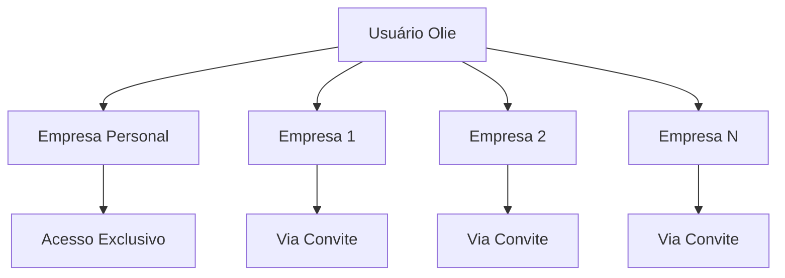

## Como funciona o sistema de usuários

Na Olie, cada usuário é cadastrado individualmente com seu e-mail pessoal, permitindo que ele acesse todo o universo da plataforma tanto de forma pessoal quanto empresarial, participando de múltiplas organizações.

<Info>
Cada usuário cadastrado na Olie possui automaticamente uma empresa chamada **Personal** de acesso exclusivo, permitindo uso individual da plataforma.
</Info>

## Convidando novos usuários

Existem dois cenários ao convidar novos usuários para sua empresa na Olie:

<Tabs>
<Tab title="Usuário já cadastrado">
  ### Usuário já possui conta na Olie
  
  Quando o usuário já está cadastrado na plataforma, o processo é simples e rápido.
  
  <Steps>
  <Step title="Envie o convite">
    Envie um convite usando o e-mail principal da conta do usuário (geralmente o e-mail pessoal).
  </Step>
  
  <Step title="Aguarde a aceitação">
    O usuário deve aceitar o convite através do site [olie.ai](https://olie.ai/) ou diretamente pelo link enviado no e-mail.
    
    <Note>
    O usuário aparecerá na listagem de usuários com o status **"Aguardando aceite"** até que ele confirme o convite.
    </Note>
  </Step>
  
  <Step title="Acesso concedido">
    Após a aceitação, o usuário terá acesso completo à sua empresa conforme as permissões configuradas.
    
    <Check>
    O usuário agora pode alternar entre sua empresa Personal e as empresas para as quais foi convidado.
    </Check>
  </Step>
  </Steps>
</Tab>

<Tab title="Novo usuário">
  ### Usuário ainda não possui conta
  
  Ao enviar um convite para um e-mail que não está vinculado a uma conta Olie, o usuário precisará se cadastrar primeiro.
  
  <Steps>
  <Step title="Envie o convite">
    Envie o convite para o e-mail do novo usuário. Recomendamos usar o e-mail pessoal.
    
    <Tip>
    Use o e-mail pessoal do usuário para que ele mantenha acesso mesmo após mudanças de emprego.
    </Tip>
  </Step>
  
  <Step title="Cadastro automático">
    O usuário recebe um e-mail com link para se cadastrar no sistema. Ao se cadastrar:
    
    - Empresa **Personal** é criada automaticamente
    - Vínculo com sua empresa é estabelecido
    - Acesso imediato após conclusão do cadastro
    
    <Warning>
    Como o usuário ainda não tem conta, ele **não aparecerá na listagem de usuários**, apenas na **listagem de convites** até concluir o cadastro.
    </Warning>
  </Step>
  
  <Step title="Primeiro acesso">
    Após concluir o cadastro, o usuário pode acessar a plataforma e alternar entre sua empresa Personal e sua empresa.
  </Step>
  </Steps>
</Tab>
</Tabs>

<Note>
Para ambos os casos, o usuário terá acesso à empresa, porém sem permissões. Use o pepel para atribuir as permissões necessárias.
</Note>

## Desabilitando ou habilitando usuários

Você pode controlar o acesso de usuários à sua empresa sem removê-los permanentemente.

<Steps>
<Step title="Acesse o painel gerencial">
  Navegue até **Empresa > Usuários** no painel gerencial.
</Step>

<Step title="Selecione o usuário">
  Localize e selecione o usuário que deseja modificar.
</Step>

<Step title="Altere o status">
  No painel **"Detalhes em [sua empresa]"**, clique sobre o status atual para alterá-lo.
  
  <AccordionGroup>
  <Accordion title="Desabilitar usuário">
    - Remove o acesso do usuário à empresa
    - Mantém o histórico e vínculos
    - Pode ser revertido a qualquer momento
    - O usuário não pode mais fazer login na sua empresa
  </Accordion>
  
  <Accordion title="Habilitar usuário">
    - Restaura o acesso do usuário
    - Mantém as permissões anteriores
    - O usuário pode fazer login imediatamente
  </Accordion>
  </AccordionGroup>
</Step>
</Steps>

<Warning>
Desabilitar um usuário não exclui seus dados ou histórico. Use esta funcionalidade quando precisar remover temporariamente o acesso de alguém.
</Warning>

## Melhores práticas

<CardGroup cols={2}>
<Card title="Use e-mails pessoais" icon="envelope">
  Cadastre usuários com e-mails pessoais para garantir continuidade de acesso independente de mudanças profissionais. Você pode atribuir um e-mail corporativo para o usuário.
</Card>

<Card title="Gerencie permissões" icon="shield-halved">
  Configure papéis e permissões apropriadas antes de habilitar o acesso do usuário.
</Card>

<Card title="Monitore convites" icon="clock">
  Acompanhe regularmente a lista de convites pendentes para garantir que todos foram aceitos.
</Card>

<Card title="Documente mudanças" icon="file-lines">
  Mantenha registro de quando usuários foram desabilitados ou habilitados para auditoria futura.
</Card>
</CardGroup>

## Estrutura de usuários

<Tip>
A estrutura de usuários da Olie permite que cada pessoa tenha uma conta unificada com acesso a múltiplas empresas, facilitando a colaboração entre organizações diferentes.
</Tip>
