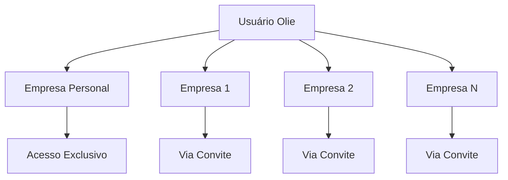

Esta página mostra como convidar pessoas para a sua empresa na Olie e como habilitar ou desabilitar o acesso de cada usuário. Para definir o que cada pessoa pode fazer, veja [Papéis e permissões](/guides/users/roles-permissions).

## Como funciona o sistema de usuários

Na Olie, cada usuário tem um cadastro próprio, feito com o e-mail pessoal. Com esse único cadastro, a pessoa usa a plataforma de forma individual e participa de várias empresas.

Todo usuário ganha automaticamente uma empresa chamada **Personal**, de acesso exclusivo, para uso individual. As demais empresas são acessadas por convite.

```mermaid
graph TD
    A[Usuário Olie] --> B[Empresa Personal]
    A --> C[Empresa 1]
    A --> D[Empresa 2]
    A --> E[Empresa N]
    
    B --> B1[Acesso Exclusivo]
    C --> C1[Via Convite]
    D --> D1[Via Convite]
    E --> E1[Via Convite]
```

## Convidando novos usuários

O convite segue um caminho diferente conforme a pessoa já tenha ou não cadastro na Olie. Nos dois casos, ela entra na sua empresa **sem nenhuma permissão**: depois do aceite, atribua um [papel](/guides/users/roles-permissions) com as permissões necessárias.

<Tabs>
<Tab title="Usuário já cadastrado">
  Quando a pessoa já tem cadastro na Olie, ela só precisa aceitar o convite.

  <Steps>
  <Step title="Envie o convite">
    Envie um convite usando o e-mail principal da conta do usuário (geralmente o e-mail pessoal).
  </Step>
  
  <Step title="Aguarde a aceitação">
    O usuário aceita o convite pelo site [olie.ai](https://olie.ai/) ou pelo link enviado no e-mail.
    
    <Note>
    O usuário aparecerá na listagem de usuários com o status **"Aguardando aceite"** até que ele confirme o convite.
    </Note>
  </Step>
  
  <Step title="Acesso concedido">
    Após o aceite, o usuário passa a acessar a sua empresa, dentro das permissões do papel que você atribuir a ele.
    
    <Check>
    O usuário agora pode alternar entre sua empresa Personal e as empresas para as quais foi convidado.
    </Check>
  </Step>
  </Steps>
</Tab>

<Tab title="Novo usuário">
  Quando o e-mail convidado não está ligado a nenhum cadastro na Olie, a pessoa precisa se cadastrar primeiro.

  <Steps>
  <Step title="Envie o convite">
    Envie o convite para o e-mail pessoal do novo usuário. Com o e-mail pessoal, a pessoa mantém o cadastro mesmo se mudar de emprego.
  </Step>
  
  <Step title="Cadastro automático">
    O usuário recebe um e-mail com link para se cadastrar no sistema. Ao se cadastrar:
    
    - a empresa **Personal** dele é criada automaticamente;
    - o vínculo com a sua empresa é criado;
    - o acesso é liberado assim que o cadastro termina.

    <Note>
    Até concluir o cadastro, a pessoa **não aparece na listagem de usuários**, apenas na **listagem de convites**.
    </Note>
  </Step>
  
  <Step title="Primeiro acesso">
    Após concluir o cadastro, o usuário pode acessar a plataforma e alternar entre sua empresa Personal e sua empresa.
  </Step>
  </Steps>
</Tab>
</Tabs>

## Desabilitando ou habilitando usuários

Desabilitar um usuário tira o acesso dele à sua empresa sem excluir os dados nem o histórico. Use quando precisar remover o acesso de alguém temporariamente.

<Steps>
<Step title="Acesse o painel gerencial">
  Navegue até **Empresa > Usuários** no painel gerencial.
</Step>

<Step title="Selecione o usuário">
  Localize e selecione o usuário que deseja modificar.
</Step>

<Step title="Altere o status">
  No painel **"Detalhes em [sua empresa]"**, clique sobre o status atual para alterá-lo.
  
  <AccordionGroup>
  <Accordion title="Desabilitar usuário">
    - Remove o acesso do usuário à empresa
    - Mantém o histórico e vínculos
    - Pode ser revertido a qualquer momento
    - O usuário não pode mais fazer login na sua empresa
  </Accordion>
  
  <Accordion title="Habilitar usuário">
    - Restaura o acesso do usuário
    - Mantém as permissões anteriores
    - O usuário pode fazer login imediatamente
  </Accordion>
  </AccordionGroup>
</Step>
</Steps>

O status de um usuário com o papel **Property** não pode ser alterado. Ao tentar, a tela avisa: *Não é possível alterar o status de um usuário com o papel "Property".* Para desabilitar essa pessoa, retire antes o papel Property dela.

## Melhores práticas

Estes cuidados mantêm o acesso à empresa organizado:

<CardGroup cols={2}>
<Card title="Use e-mails pessoais" icon="envelope">
  Cadastre usuários com e-mails pessoais para garantir continuidade de acesso independente de mudanças profissionais. Você pode atribuir um e-mail corporativo para o usuário.
</Card>

<Card title="Gerencie permissões" icon="shield-halved">
  Configure papéis e permissões apropriadas antes de habilitar o acesso do usuário.
</Card>

<Card title="Monitore convites" icon="clock">
  Acompanhe regularmente a lista de convites pendentes para garantir que todos foram aceitos.
</Card>

<Card title="Documente mudanças" icon="file-lines">
  Mantenha registro de quando usuários foram desabilitados ou habilitados para auditoria futura.
</Card>
</CardGroup>

## Próximos passos

Depois de convidar as pessoas, continue por estas páginas:

- [Papéis e permissões](/guides/users/roles-permissions): defina o que cada usuário pode fazer.
- [Tipos de papéis](/guides/users/role-types): entenda como as permissões definem a licença que o usuário ocupa.
